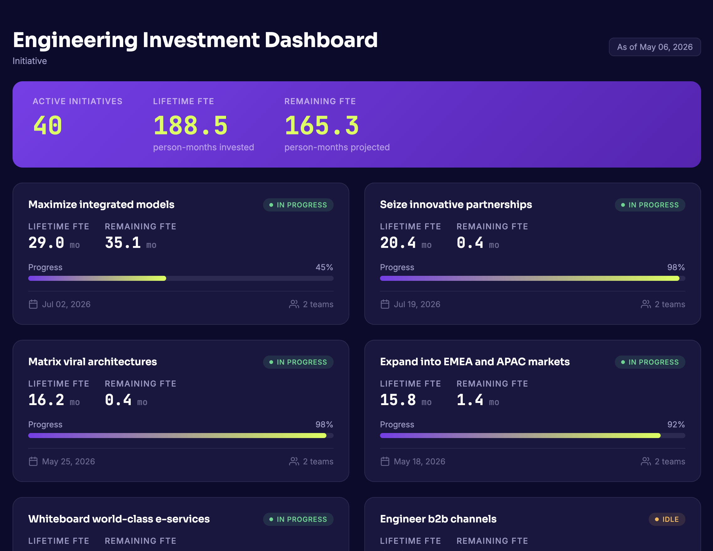

# Jellyfish MCP Server

> **Security Notice**: There are known risks and inherent limitations in this implementation. Refer to [`SECURITY.md`](SECURITY.md) before using.

> [!IMPORTANT]
> PromptGuard is not bundled with this server. We recommend configuring it before using `jellyfish-mcp` daily — see [PROMPTGUARD.md](PROMPTGUARD.md) for setup and [SECURITY.md](SECURITY.md) before using.

## Overview

A Model Context Protocol server for retrieving and analyzing data from Jellyfish's API. This server allows a host (e.g. Claude Desktop or Cursor) to interact with your Jellyfish instance, enabling natural language queries about your engineering metrics, team data, and other information available through the Jellyfish API.

Once you have the Jellyfish MCP connected, you can ask questions about your Jellyfish data, such as:

- "What were our company metrics in May 2026?"
- "Can you get a list of my organization's teams?"
- "What are the unlinked pull requests for the last month?"

## Install

See **[INSTALL.md](INSTALL.md)** for the full setup guide. Quick links:

- **Claude Desktop** — [download the `.mcpb` extension](https://github.com/Jellyfish-AI/jellyfish-mcp/releases/latest/download/jellyfish-mcp.mcpb), then double-click to install
- **Claude Code, Cursor, VSCode** — `npx jellyfish-mcp-server@latest` (recommended) or Docker

## Develop

Want to modify the source or run from a local clone? See **[DEVELOPMENT.md](DEVELOPMENT.md)**.

## Tools and Resources

The server provides several tools for interacting with the Jellyfish API. Each tool corresponds to a specific Jellyfish API endpoint and allows you to retrieve or search for data as described in the API.

### General

- `get_api_schema` - Retrieves the complete API schema with all available API endpoints

### AI Impact

- `ai_company_adoption_analytics`
- `ai_company_impact_analytics`
- `ai_person_adoption`
- `ai_person_adoption_analytics`
- `ai_team_adoption_analytics`
- `ai_team_impact_analytics`

### Allocations

- `allocations_by_person`
- `allocations_by_team`
- `allocations_by_investment_category`
- `allocations_by_investment_category_person`
- `allocations_by_investment_category_team`
- `allocations_by_work_category`
- `allocations_by_work_category_person`
- `allocations_by_work_category_team`
- `allocations_filter_fields`
- `allocations_summary_by_investment_category`
- `allocations_summary_by_work_category`

### Delivery

- `deliverable_details`
- `deliverable_scope_and_effort_history`
- `work_categories`
- `work_category_contents`

### DevEx

- `devex_insights_by_team`

### Metrics

- `company_metrics`
- `person_metrics`
- `team_metrics`
- `team_sprint_summary`
- `unlinked_pull_requests`

### People

- `list_engineers`
- `search_people`

### Teams

- `list_teams`
- `search_teams`

### Help Center

- `search_articles`
- `get_article`

## Skills

In addition to the MCP tools above, the Jellyfish MCP pairs with optional Agent Skills. Skills can similarly be invoked throughout the chat conversation, but are not bundled with the MCP and need to be independently installed. To install, go to the [`skills/`](skills/) directory and add each Skill individually to your host application.

> **Security note:** Skills may ask the LLM to author HTML directly, building it from data returned by the Jellyfish API. Because the HTML is generated rather than fixed, using a skill means trusting that the data Jellyfish returns and the HTML the model builds from it are both safe to render. If that trust is misplaced, a skill could produce dangerous output, including HTML or JavaScript that the user did not intend. Skills are entirely optional and are installed separately, so anyone who would rather not take on this assumption can simply leave them uninstalled. See [`SECURITY.md`](SECURITY.md) for the full discussion.

### Dashboards

- `jellyfish-custom-dashboards` — Generate branded HTML dashboards from Jellyfish engineering analytics. Currently supports engineering investment reports.

## License

This code is distributed under the MIT license. See [LICENSE](LICENSE).
